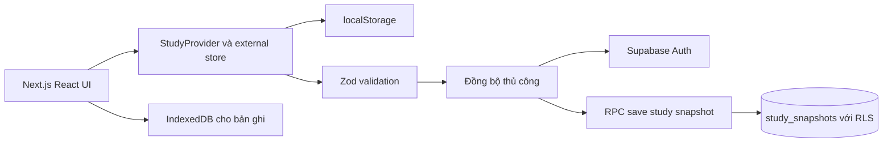

# Báo cáo bàn giao website Mây VSTEP

**Ngày chốt báo cáo:** 10/09/2026  
**Mốc nền tảng được đánh giá:** vòng hoàn thiện Reading và Listening ngày 10/09/2026
**Nhánh chính:** `main`  
**Repository:** <https://github.com/binhphanbp/vstep>  
**Bản HTTPS pilot:** <https://vstep-turtle.vercel.app>
**Đối tượng sử dụng:** một người học VSTEP tại TP.HCM, tên thân mật “Rùa”, được gọi là “Gùa” trong website

## 1. Kết luận bàn giao

Mây hiện là một ứng dụng luyện VSTEP cá nhân có kế hoạch học theo ngày, thư viện luyện bốn kỹ năng, hai chế độ thi có giờ, từ vựng, ôn lỗi sai, lịch sử tiến bộ, ghi âm, sao lưu và đồng bộ Supabase thủ công. Reading/Listening đã có phản hồi theo dạng câu và độ chắc chắn; phần thi có giờ cảnh báo câu bỏ trống và chỉ mở transcript Listening sau khi hoàn thành. Giao diện đã được kiểm thử tự động ở viewport máy tính và điện thoại, chuyển sang tone hồng pastel, tối ưu cho tiếng Việt và cá nhân hóa cho Gùa. Mọi nút tương tác khai báo ngữ nghĩa rõ ràng, bộ lọc có trạng thái đọc được và ứng dụng có màn hình phục hồi cả khi lỗi ở root layout. Bản build, GitHub Actions và smoke test trên URL HTTPS pilot đã đạt; chưa có nghiệm thu trên iOS/Android thật.

Sản phẩm đủ để Gùa pilot hằng ngày trên bản HTTPS hoặc local nhằm thu thập phản hồi thực tế. Chưa nên mô tả đây là hệ luyện thi VSTEP toàn diện đã được kiểm định hoặc đã nghiệm thu production. Nội dung đang là nội dung tự biên soạn, mới có một đề đủ cấu trúc, bài Nghe dùng giọng tổng hợp và bài Viết/Nói chưa có chấm điểm từ giáo viên hoặc AI. Bản host chưa được kiểm thử đăng nhập/sync bằng tài khoản thật, micro hoặc thiết bị thật của người học.

Không có task dở dang trong milestone nền tảng tại mốc bàn giao. Các milestone về học liệu, đánh giá đầu vào, phản hồi Viết/Nói và vận hành production vẫn đang mở và được liệt kê tại Mục 12.

## 2. Mục tiêu sản phẩm và hướng đi

Website được xây cho một người học cụ thể, không phải nền tảng thương mại hoặc hệ thống quản trị nhiều người dùng. Hướng đi phù hợp là một “góc học riêng” giúp người học mở website và biết ngay hôm nay nên học gì, học trong bao lâu, vì sao bài đó được chọn và mình đã tiến bộ thế nào.

Ba nguyên tắc đang chi phối thiết kế sản phẩm:

1. **Giảm áp lực bắt đầu.** Mỗi ngày chỉ gợi ý tối đa ba hoạt động phù hợp quỹ thời gian. Khi chọn trạng thái “Hơi mệt”, ngân sách học giảm xuống tối đa 15 phút.
2. **Cá nhân hóa bằng dữ liệu thật.** Kế hoạch dựa trên lỗi đến hạn, lỗi sai với mức tự tin cao, độ chính xác gần đây, độ lâu chưa luyện, ngày thi, kỹ năng ưu tiên, chủ đề yêu thích và mức năng lượng. Mỗi bài gợi ý hiển thị lý do được chọn. Hệ thống không tạo điểm khởi đầu hoặc thành tích giả.
3. **Trung thực về năng lực sản phẩm.** Trắc nghiệm có thể chấm tự động; bài Viết và Nói chỉ lưu bài, hỗ trợ tự kiểm tra và đưa bài mẫu. Website không tự quy đổi kết quả sang bậc B1, B2 hoặc C1.

Trong các vòng phát triển tiếp theo, nên ưu tiên chất lượng học liệu, phản hồi Viết/Nói và trải nghiệm trên thiết bị thật trước khi mở rộng thêm tính năng trang trí hoặc cơ chế trò chơi.

## 3. Nỗi đau người học và cách website giải quyết

| Nỗi đau                                        | Giải pháp đã triển khai                                                                                                                                                                     | Trạng thái                             |
| ---------------------------------------------- | ------------------------------------------------------------------------------------------------------------------------------------------------------------------------------------------- | -------------------------------------- |
| Không biết hôm nay học gì                      | Kế hoạch ngày tự chọn tối đa ba bài theo thời gian, lỗi đến hạn, mức chắc chắn, độ chính xác, độ lâu chưa luyện, ngày thi, kỹ năng ưu tiên và sở thích; từng bài giải thích lý do được chọn | Hoàn thành bản cá nhân hóa v2 đầu tiên |
| Khó duy trì khi mệt hoặc bận                   | Chọn mức năng lượng; ngày mệt tự giảm quỹ học; chuỗi ngày tính theo giờ Việt Nam và không phạt ngày hiện tại chưa kết thúc                                                                  | Hoàn thành                             |
| Làm sai lặp lại nhưng không biết ôn gì         | Kết quả tách theo dạng câu và độ chắc chắn; câu sai được gom theo subskill, số lần sai; lỗi “sai nhưng rất chắc” được ưu tiên, yêu cầu làm lại và có lịch ôn                           | Hoàn thành vòng phản hồi đầu tiên      |
| Học từ rồi quên                                | 20 thẻ từ có phiên âm, nghĩa, ví dụ, phát âm và lịch ôn theo mức nhớ                                                                                                                        | Hoàn thành ở quy mô ban đầu            |
| Ngại luyện Viết và Nói                         | Nháp tự lưu, đếm từ, tiêu chí tự kiểm tra, bài mẫu; Nói có ghi âm, nghe lại và tải file                                                                                                     | Hoàn thành phần tự luyện               |
| Lo áp lực thời gian và chuyển phần             | Có buổi rút gọn 51 phút và đề đủ cấu trúc 172 phút; đồng hồ theo deadline tuyệt đối, phục hồi sau tải lại                                                                                   | Hoàn thành                             |
| Sợ mất bài khi tab treo hoặc trình duyệt crash | Tự lưu localStorage, IndexedDB cho audio, JSON backup, bảo vệ dữ liệu hỏng và xử lý nhiều tab                                                                                               | Hoàn thành trong giới hạn trình duyệt  |
| Không nhìn thấy tiến bộ                        | Thống kê phút học, số lượt, chuỗi ngày, độ chính xác Nghe/Đọc và lịch sử bài                                                                                                                | Hoàn thành                             |
| Học một mình dễ nhàm chán                      | Giao diện hồng pastel, microcopy nhẹ nhàng, mood check-in, con trỏ riêng và cá nhân hóa “Gùa/Rùa”                                                                                           | Hoàn thành                             |

## 4. Phạm vi chức năng đã hoàn thành

### 4.1 Góc học hôm nay

- Chào người học theo tên đã cấu hình; mặc định là “Gùa”.
- Tạo kế hoạch ngày ổn định trong cùng một ngày, tối đa ba bài và tránh lặp kỹ năng trong một kế hoạch.
- Ưu tiên bài chưa học, kỹ năng cần tập trung, chủ đề yêu thích và kỹ năng có độ chính xác gần đây dưới 65%.
- Hiển thị bài đã hoàn thành, số phút đã học, lịch bảy ngày và số từ đến hạn ôn.
- Cho chọn năng lượng “Hơi mệt”, “Ổn nè” hoặc “Đầy năng lượng”.

### 4.2 Hồ sơ và cá nhân hóa

- Cấu hình tên gọi, mục tiêu B1/B2/C1, trình độ tự đánh giá, ngày thi, số phút học mỗi ngày, kỹ năng ưu tiên và chủ đề yêu thích.
- Dùng “Gùa” trong lời chào, động viên, kế hoạch và tiến độ; dùng “Rùa nhỏ” như dấu ấn thân mật ở sidebar.
- Tự chuyển hồ sơ mặc định cũ có tên “bạn” sang “Gùa” mà không thay tên do người học đã chọn.
- Cảnh báo rõ kho bài hiện tập trung B1-B2 nếu người học chọn C1.

### 4.3 Lộ trình

- Bốn chặng: làm quen và tìm nhịp; vững nền; mở rộng và kết nối ý; tập nhịp thi và nhìn lại.
- Trạng thái từng chặng được tính từ hồ sơ và lịch sử bài đã làm, không đánh dấu hoàn thành giả.
- Nút hành động đưa thẳng đến bước tiếp theo phù hợp.

### 4.4 Thư viện luyện bốn kỹ năng

- 14 bài luyện ngắn gồm 4 bài Đọc, 4 bài Nghe, 3 bài Viết và 3 bài Nói.
- Bài Đọc/Nghe có câu hỏi, đáp án, giải thích, chấm điểm chính xác và chẩn đoán theo dạng câu cùng mức chắc chắn.
- Bài Viết có đề, giới hạn thời gian gợi ý, đếm từ, nháp tự lưu, checklist tự đánh giá và bài mẫu.
- Bài Nói có đề, gợi ý cấu trúc, ghi âm qua MediaRecorder, nghe lại, tải file và lưu bản ghi theo lượt học.
- Bộ lọc theo kỹ năng, tìm kiếm và trạng thái đã khám phá.

### 4.5 Phòng luyện có giờ

- **Chế độ rút gọn 51 phút:** Nghe 10 phút, Đọc 15 phút, Viết 20 phút, Nói 6 phút.
- **Chế độ đủ cấu trúc 172 phút:** Nghe 40 phút với 35 câu, Đọc 60 phút với 40 câu, Viết 60 phút với email và essay, Nói 12 phút với ba phần.
- Đồng hồ dùng deadline tuyệt đối nên tiếp tục đúng sau khi reload, chuyển tab hoặc để máy ngủ.
- Tự lưu đáp án, hai bài Viết và bản ghi từng phần Nói.
- Báo rõ số câu Nghe/Đọc còn bỏ trống trước khi nộp; transcript Nghe chỉ xuất hiện trong phần đối chiếu sau khi hoàn thành.
- Tự chuyển phần khi hết giờ; có điều kiện chống tab cũ nộp nhầm phần mới và chống tạo lượt nộp trùng.
- Kết quả tách rõ điểm câu hỏi khách quan với phần Viết/Nói chưa được chấm.

### 4.6 Từ vựng và sổ lỗi sai

- 20 từ có IPA, nghĩa tiếng Việt, ví dụ và chủ đề.
- Phát âm bằng giọng tổng hợp của thiết bị.
- Lịch ôn thay đổi theo bốn mức: chưa nhớ, khó, nhớ rồi và rất chắc.
- Câu sai từ bài luyện và đề thi được gom một lần vào sổ lỗi.
- Người học phải chọn lại đáp án trước khi xem kết quả và giải thích.

### 4.7 Tiến bộ và lịch sử

- Tổng phút luyện, số lượt, số bài khác nhau, chuỗi ngày và biểu đồ bảy ngày.
- Thống kê riêng cho bốn kỹ năng; độ chính xác chỉ hiển thị cho bài có câu hỏi khách quan.
- Lưu nội dung bài Viết, phần tự đánh giá và bản ghi Nói đã hoàn thành.

### 4.8 Sao lưu và khôi phục

- Xuất toàn bộ state học tập ra JSON.
- Nhập JSON có kiểm tra schema bằng Zod, giới hạn 10 MB, kiểm tra điểm bất khả thi và ID lượt học trùng.
- Trước khi nhập hoặc tải từ cloud, hệ thống tự tải bản thiết bị hiện tại làm bản dự phòng.
- Khi localStorage hỏng, ứng dụng không ghi đè bản gốc và báo lỗi để người dùng xử lý.
- Audio không nằm trong JSON; từng bản ghi phải tải riêng.

## 5. UX UI và nhận diện hiện tại

- Tone chính là hồng pastel sáng với nền blush, điểm nhấn rose, chữ charcoal và lavender-gray; bốn kỹ năng vẫn có màu phụ riêng để dễ nhận biết.
- Font Be Vietnam Pro hỗ trợ tiếng Việt và được tải qua `next/font/google` khi build.
- Bố cục desktop có sidebar cố định; mobile dùng menu đóng mở, hỗ trợ Escape và giữ focus trong menu.
- Có skip link, focus state, nhãn form, trạng thái lỗi, loading, empty state và trang 404.
- Con trỏ tùy biến dùng chấm và vòng hồng, chỉ bật với thiết bị chuột chính xác. Nó tự tắt trong ô nhập liệu, trên thiết bị cảm ứng và khi người dùng bật reduced motion.
- Animation tuân theo `prefers-reduced-motion`.
- Microcopy được viết theo hướng nhẹ nhàng, không dùng bảng xếp hạng, popup gây áp lực hoặc thành tích ảo.

## 6. Kiến trúc kỹ thuật

### 6.1 Tech stack

| Thành phần      | Công nghệ                                          | Vai trò                                                  |
| --------------- | -------------------------------------------------- | -------------------------------------------------------- |
| Web framework   | Next.js 16.3.4 App Router                          | Routing, metadata, SSG và production build               |
| UI runtime      | React 19.2.8, TypeScript                           | Component và trạng thái giao diện                        |
| Styling         | Tailwind CSS 4, CSS variables và component classes | Theme, responsive và trạng thái tương tác                |
| Icon            | Lucide React                                       | Hệ icon nhất quán                                        |
| Validation      | Zod 4.5.4                                          | Kiểm tra profile, state, backup và payload cloud         |
| Cloud           | Supabase JS 2.116                                  | Auth và snapshot đồng bộ thủ công                        |
| Browser storage | localStorage, IndexedDB                            | State học tập và Blob ghi âm                             |
| Testing         | Vitest, Playwright, axe-core, PGlite               | Unit, database, E2E, accessibility và production QA      |
| CI              | GitHub Actions, Node.js 24                         | Cài sạch, kiểm tra, build và chạy trình duyệt production |

### 6.2 Luồng dữ liệu



Ứng dụng hiện không có API route riêng. Phần học chạy phía client; các route bài học được tạo tĩnh bằng `generateStaticParams`. Cách này phù hợp với phạm vi một người dùng, giảm chi phí vận hành và vẫn cho phép chạy hoàn toàn trên thiết bị khi Supabase không khả dụng.

### 6.3 Mô hình state

State phiên bản 1 gồm hồ sơ, lượt học, lịch ôn từ, lịch ôn lỗi, nháp, tâm trạng theo ngày, phiên thi đang chạy và thời điểm cập nhật. `useSyncExternalStore` cung cấp snapshot nhất quán cho React. Mỗi mutation tăng `updatedAt`; ứng dụng đọc lại bản mới hơn trước khi ghi để giảm nguy cơ tab cũ ghi đè.

Bản ghi âm được lưu riêng trong IndexedDB vì Blob không phù hợp để nhét vào localStorage hoặc snapshot JSON. Vì vậy, đồng bộ Supabase và file backup chỉ đồng bộ dữ liệu học dạng JSON, không đồng bộ audio.

## 7. Supabase và bảo mật dữ liệu

### 7.1 Trạng thái thực tế

- `.env.local` hiện có Project URL và publishable key; file này được `.gitignore` và không nằm trong Git.
- Migration `supabase/migrations/001_personal_study.sql` đã chạy thành công trên dự án Supabase thật.
- `allowed_learners` và `study_snapshots` đã được tạo và bật Row Level Security.
- Đăng ký công khai đã tắt; một tài khoản Auth đã được tạo, xác nhận email và thêm UUID vào `allowed_learners`.
- Đã kiểm thử thực tế tạo snapshot revision 1, cập nhật revision 2, đọc lại và từ chối revision cũ. Dữ liệu QA trong transaction đã rollback.
- Đã đăng nhập từ giao diện local, lưu snapshot revision 1 và tải lại snapshot về thiết bị thành công.
- Chưa nghiệm thu đồng bộ trên thiết bị hoặc trình duyệt thứ hai.

### 7.2 Cơ chế bảo vệ

- Client chỉ dùng publishable key. Không được đưa service role key vào `NEXT_PUBLIC_*` hoặc repository.
- RLS chỉ cho tài khoản đã đăng nhập và có tên trong `allowed_learners` đọc/ghi snapshot của chính mình.
- RPC `save_study_snapshot` kiểm tra revision và dùng advisory lock trong transaction để tránh một phiên cũ ghi đè bản mới.
- Payload bị giới hạn 10 MB và phải là object state version 1.
- Website không có analytics, quảng cáo hoặc luồng tự gửi bài viết/bản ghi sang dịch vụ AI.
- Header production gồm Content Security Policy, `X-Content-Type-Options`, `X-Frame-Options`, `Referrer-Policy` và `Permissions-Policy` giới hạn camera, micro và vị trí.

## 8. Kiểm thử và bằng chứng chất lượng

Trạng thái kiểm tra local sau vòng cải tiến theo báo cáo:

| Nhóm kiểm tra         | Kết quả            | Phạm vi chính                                                                                        |
| --------------------- | ------------------ | ---------------------------------------------------------------------------------------------------- |
| ESLint                | Đạt                | Quy tắc code Next.js và TypeScript                                                                   |
| TypeScript            | Đạt                | Type generation và `tsc --noEmit`                                                                    |
| Vitest                | 47/47 đạt          | Logic học, confidence, chẩn đoán dạng câu, planner, lịch ôn, timer, store, speech, đề và SQL/RLS     |
| Playwright production | 23/23 đạt          | Các route chính, reload, nhiều tab, thi đủ cấu trúc, import/export, micro, responsive và lỗi lưu     |
| axe WCAG A/AA         | Đạt trên 13 màn    | Lỗi accessibility có thể tự động phát hiện                                                           |
| Production build      | Đạt                | 44 trang tĩnh/SSG được sinh thành công                                                               |
| Dependency audit      | 0 lỗ hổng được báo | `npm audit --omit=dev` ngày 10/09/2026                                                               |
| GitHub Actions        | Đạt                | Run `34446938974` cho commit `4e0ed58`; các run `34443900365`, `34439806721`, `34435602731` cũng đạt |

GitHub Actions chạy `npm ci`, `npm run check`, cài Chromium và chạy bộ Playwright trên `next start`, không tái sử dụng dev server. Nếu thất bại, report Playwright được giữ bảy ngày làm artifact.

Các kiểm thử đáng chú ý bao gồm: chẩn đoán Reading theo dạng câu và confidence, transcript Listening sau khi nộp, khôi phục deadline sau reload, lưu hai bài Viết riêng, lưu bản ghi Nói khi chuyển phần, chống mất đáp án giữa hai tab, giữ localStorage hỏng, từ chối micro, backup không hợp lệ, bảo vệ HTTP headers, 404 thật, custom cursor, mobile 390 px và trang kết quả đề đủ cấu trúc.

Kiểm thử tự động không thay thế nghiệm thu trên iPhone/Safari, Android/Chrome, micro thật, loa/tai nghe thật hoặc đánh giá chuyên môn của giáo viên.

## 9. Những việc chưa làm và giới hạn hiện tại

| Hạng mục                               | Trạng thái hiện tại       | Ảnh hưởng                                                                      |
| -------------------------------------- | ------------------------- | ------------------------------------------------------------------------------ |
| Hosting HTTPS pilot                    | Đã có                     | `vstep-turtle.vercel.app`; 10 route 200, 404 và headers đã smoke test          |
| Đăng nhập/sync trên bản host           | Chưa nghiệm thu           | Form cloud đã bật nhưng chưa dùng tài khoản thật trên URL production           |
| Nghiệm thu thiết bị thật               | Chưa làm                  | Chưa xác nhận micro, giọng đọc, Safari/iOS và hành vi khi màn hình tắt         |
| Thẩm định học liệu bởi giáo viên VSTEP | Chưa làm                  | Không thể khẳng định độ khó hoặc khả năng dự báo bậc                           |
| Ngân hàng đề độc lập                   | Mới có một đề đủ cấu trúc | Dùng lâu dài sẽ gặp lại ngữ liệu và đề Viết/Nói                                |
| Bản thu người nói cho Nghe             | Chưa làm                  | Speech synthesis khác điều kiện thi và chất lượng phụ thuộc thiết bị           |
| Chấm và phản hồi Viết/Nói              | Chưa làm                  | Người học chỉ tự kiểm tra; không có điểm hoặc phản hồi cá nhân sâu             |
| Đồng bộ audio                          | Chưa làm                  | Bản ghi chỉ ở thiết bị và phải tải riêng                                       |
| Tự động đồng bộ nhiều thiết bị         | Chưa làm                  | Người dùng phải chủ động Lưu/Tải và xử lý revision conflict                    |
| Hợp nhất chỉnh sửa đồng thời           | Chưa làm                  | Hai nhánh lịch sử không tự merge                                               |
| PWA/offline đầy đủ                     | Chưa làm                  | Không có service worker; chỉ dữ liệu đã tải có thể còn trong cache trình duyệt |
| Monitoring và báo lỗi production       | Chưa làm                  | Chưa có dashboard lỗi hoặc cảnh báo vận hành                                   |
| C1 toàn diện                           | Chưa làm                  | Kho nội dung hiện tập trung B1-B2                                              |
| Đa người dùng, quản trị, thanh toán    | Ngoài phạm vi có chủ đích | Phù hợp yêu cầu dùng cá nhân hiện tại                                          |

## 10. Hướng dẫn chạy và vận hành

### 10.1 Chạy local

Yêu cầu Node.js 24 và npm.

```bash
git clone https://github.com/binhphanbp/vstep.git
cd vstep
npm ci
npm run dev
```

Mở `http://127.0.0.1:3000`. Nên dùng nhất quán địa chỉ này; `localhost` và `127.0.0.1` có kho localStorage/IndexedDB khác nhau.

### 10.2 Cấu hình Supabase

1. Sao chép `.env.example` thành `.env.local`.
2. Điền `NEXT_PUBLIC_SUPABASE_URL` và `NEXT_PUBLIC_SUPABASE_PUBLISHABLE_KEY`.
3. Chạy `supabase/migrations/001_personal_study.sql` trong SQL Editor của dự án mới nếu cần dựng lại.
4. Tắt public signup trong Auth.
5. Tạo user email/mật khẩu, sau đó thêm UUID vào `allowed_learners`.
6. Khởi động lại dev server hoặc build lại production.
7. Đăng nhập tại Cài đặt, lưu từ thiết bị gốc lên cloud trước, rồi mới tải xuống thiết bị khác.

Không chép mật khẩu, service role key hoặc nội dung `.env.local` vào issue, tài liệu bàn giao công khai hoặc commit.

### 10.3 Kiểm tra trước khi phát hành

```bash
npm run check
npx playwright install chromium
npm run test:e2e
npm run test:production
npm audit --omit=dev
```

`npm run check` gồm lint, typecheck, Vitest và build. `npm run test:production` build lại rồi chạy Playwright trên `next start` cổng 3100.

### 10.4 Build production

```bash
npm run build
npm start
```

Môi trường host cần hỗ trợ Next.js/Node.js và HTTPS nếu dùng micro ngoài localhost. Hai biến Supabase phải có mặt ở thời điểm build vì chúng có prefix `NEXT_PUBLIC_*`. Build cần mạng để tải Be Vietnam Pro qua `next/font/google`.

## 11. Quy trình sao lưu và phục hồi

### Sao lưu định kỳ

1. Vào Cài đặt và chọn **Xuất bản sao** sau các mốc học quan trọng.
2. Nếu đã đăng nhập Supabase, chọn **Lưu lên đám mây** sau buổi học.
3. Với bài Nói quan trọng, mở lịch sử và tải riêng file audio.
4. Lưu file JSON/audio ở nơi có backup riêng; không chỉ giữ trên cùng một thiết bị.

### Khôi phục thiết bị

1. Nếu có snapshot cloud, đăng nhập và chọn **Tải về thiết bị**. Website tự xuất bản thiết bị hiện tại trước khi thay thế.
2. Nếu dùng JSON, chọn **Nhập bản sao** và kiểm tra đúng tên cùng số lượt học trong hộp xác nhận.
3. Tải lại audio thủ công nếu có lưu file bên ngoài; bản JSON/cloud không chứa audio.
4. Nếu báo revision conflict, xuất bản cục bộ trước, sau đó tải bản cloud mới nhất. Không cố lưu đè bằng cách sửa revision trong DevTools.

## 12. Lộ trình đề xuất sau bàn giao

### P0 Trước khi dùng như một sản phẩm production

1. **Hoàn tất nghiệm thu bản HTTPS.** Vercel pilot, biến môi trường, headers, 404 và font đã kiểm tra. Còn đăng nhập/sync bằng tài khoản thật, micro và kiểm tra không có secret trong bundle ngoài publishable key.
2. **Nghiệm thu trên thiết bị của Gùa.** Thử iPhone/Safari hoặc Android/Chrome thực tế, máy tính chính, tai nghe, micro, speech synthesis, reload giữa bài và màn hình tắt. Tiêu chí đạt: hoàn thành một bài Nói, một bài Nghe, một mini exam và tải lại không mất dữ liệu.
3. **Kiểm thử đồng bộ hai thiết bị.** Lưu từ thiết bị A, tải ở B, học thêm ở B, lưu lại và tải về A. Cố tình tạo conflict để xác nhận thông báo và quy trình backup dễ hiểu.
4. **Chốt quy trình backup.** Quy định tần suất xuất JSON và tải audio; thực hiện một lần khôi phục từ đầu trên profile trình duyệt mới.

### P1 Nâng chất lượng học tập

1. Mời giáo viên VSTEP rà rubric, đáp án, độ khó, từ vựng, thời lượng và mức B1/B2.
2. Xây ngân hàng đề độc lập đủ dùng trong nhiều tuần, không tái sử dụng bài đã học trong bài đo tiến bộ.
3. Thu hoặc mua quyền sử dụng audio người nói với tốc độ, giọng và nhiễu phù hợp từng phần thi.
4. Thêm phản hồi Viết/Nói theo rubric. Nếu dùng AI, phải lưu rubric, ví dụ chuẩn, giới hạn độ tin cậy và luôn tách phản hồi gợi ý khỏi điểm chính thức.
5. Thêm bài đánh giá đầu vào và checkpoint định kỳ sau khi có bộ câu hỏi đã được hiệu chuẩn.

### P2 Tăng chiều sâu cá nhân hóa và vận hành

1. Đã triển khai vòng đầu của kế hoạch theo ngày thi, lỗi đến hạn, lỗi tự tin cao, độ chính xác, recency và diversity guard; cần hiệu chỉnh trọng số sau 5–7 ngày dữ liệu thật.
2. Mở rộng từ vựng theo lỗi trong bài và theo chủ đề người học quan tâm.
3. Cân nhắc PWA/offline nếu người học thường mất mạng.
4. Cân nhắc lưu audio có kiểm soát trên Supabase Storage nếu thật sự cần dùng nhiều thiết bị.
5. Bổ sung monitoring lỗi production và quy trình cập nhật dependency định kỳ.

## 13. Cấu trúc mã nguồn cần biết

| Đường dẫn                                    | Nội dung                                                     |
| -------------------------------------------- | ------------------------------------------------------------ |
| `src/app`                                    | Route, metadata, layout, error, global-error và not-found    |
| `src/components/dashboard.tsx`               | Góc học hôm nay và kế hoạch ngày                             |
| `src/components/practice.tsx`                | Thư viện và phiên luyện kỹ năng                              |
| `src/components/exam.tsx`                    | Luồng mini/full exam và điều phối phần thi                   |
| `src/components/audio-tools.tsx`             | Speech synthesis, ghi âm, phát và tải audio                  |
| `src/components/review.tsx`                  | Từ vựng và sổ lỗi sai                                        |
| `src/components/settings.tsx`                | Hồ sơ, backup, Auth và cloud sync                            |
| `src/lib/content.ts`                         | 14 bài ngắn, 20 từ và nguồn tham khảo                        |
| `src/lib/full-exam-content.ts`               | Ngữ liệu đề đủ cấu trúc                                      |
| `src/lib/learning.ts`                        | Schema, kế hoạch, lịch ôn, chấm điểm và state machine kỳ thi |
| `src/lib/study-store.ts`                     | Store, localStorage, nhiều tab và phục hồi                   |
| `src/lib/recordings.ts`                      | IndexedDB cho bản ghi                                        |
| `supabase/migrations/001_personal_study.sql` | Bảng, RLS và RPC snapshot                                    |
| `tests/unit`                                 | Logic và database tests                                      |
| `tests/e2e`                                  | E2E, accessibility, resilience và full exam                  |
| `.github/workflows/check.yml`                | Pipeline CI                                                  |

## 14. Các quyết định quan trọng cần giữ

- Giữ kiến trúc local-first vì sản phẩm dành cho một người, giúp học được ngay cả khi cloud lỗi.
- Giữ cloud sync thủ công và cảnh báo conflict cho đến khi có nhu cầu thật về tự động đồng bộ.
- Không hiển thị điểm dự đoán B1/B2/C1 từ dữ liệu chưa hiệu chuẩn.
- Không đưa audio vào localStorage hoặc JSON; dùng IndexedDB và file tải riêng.
- Không bật public signup; chỉ cấp tài khoản thủ công trong `allowed_learners`.
- Không thêm service role key vào client.
- Không biến chuỗi ngày, badge hoặc thông báo thành cơ chế gây áp lực.
- Khi cập nhật Next.js, phải đọc hướng dẫn nằm trong `node_modules/next/dist/docs/` vì phiên bản dự án có thay đổi API và convention so với các phiên bản cũ.

## 15. Checklist bàn giao quyền truy cập

- [x] Code đã push lên repository GitHub, nhánh `main`.
- [x] Commit bàn giao đã qua GitHub Actions.
- [x] `.env.local` được bỏ qua bởi Git.
- [x] Supabase migration, RLS, Auth và đồng bộ một thiết bị đã kiểm tra.
- [ ] Người nhận xác nhận có quyền quản trị repository GitHub.
- [ ] Người nhận xác nhận có quyền truy cập dự án Supabase.
- [ ] Người nhận lưu thông tin tài khoản học ở trình quản lý mật khẩu an toàn.
- [x] Tạo bản hosting HTTPS pilot trên Vercel và cấu hình biến môi trường Supabase.
- [ ] Bàn giao quyền truy cập dự án Vercel và chốt tên miền riêng nếu cần.
- [ ] Nghiệm thu trên thiết bị thật của Gùa.
- [ ] Chốt người chịu trách nhiệm nội dung VSTEP và lịch cập nhật học liệu.

## 16. Lịch sử phát triển chính

| Commit    | Nội dung                                                                           |
| --------- | ---------------------------------------------------------------------------------- |
| `96d1a61` | Xây trải nghiệm luyện VSTEP cá nhân, nội dung, thi có giờ, lưu dữ liệu và Supabase |
| `7e3ab8e` | Thêm custom cursor responsive và accessible                                        |
| `026a290` | Tinh chỉnh bảng màu hồng pastel                                                    |
| `ed9007f` | Cá nhân hóa toàn bộ hành trình cho Gùa và Rùa                                      |
| `13e6683` | Thêm mức tự tin, ưu tiên lỗi sai và Daily Mission v2                               |
| `343a02f` | Đồng bộ báo cáo bàn giao với HTTPS pilot đã xác thực                               |
| `867cb68` | Thêm màn hình phục hồi khi root layout gặp lỗi                                     |
| `4e0ed58` | Chuẩn hóa ngữ nghĩa nút, bộ lọc, timer và cập nhật trạng thái trợ năng             |

## 17. Tiêu chí hoàn tất giai đoạn hiện tại

Milestone nền tảng và hosting kỹ thuật được xem là hoàn tất vì các route chính hoạt động, state được bảo toàn, hai chế độ thi chạy hết luồng, Supabase thật đã xác nhận, URL HTTPS trả đúng status/headers, test production và CI đều đạt. Giai đoạn production vận hành chỉ được xem là hoàn tất sau khi nghiệm thu đăng nhập/sync, micro, thiết bị thật, thử đồng bộ hai thiết bị và có người chịu trách nhiệm xác nhận chất lượng học liệu.

| Nhóm tiêu chí       | Kết luận hiện tại | Bằng chứng hoặc bước còn thiếu                                               |
| ------------------- | ----------------- | ---------------------------------------------------------------------------- |
| Nền tảng kỹ thuật   | Đạt milestone     | Build, unit, E2E, accessibility, Supabase Auth/RLS và backup đã kiểm tra     |
| Cá nhân hóa         | Đạt vòng v2 đầu   | Có confidence, due review, weakness, recency, exam urgency và lý do chọn bài |
| Hiệu quả học tập    | Chưa kết luận     | Cần 5–7 ngày pilot và checkpoint bằng ngữ liệu chưa từng học                 |
| Chất lượng học liệu | Chưa kiểm định    | Cần giáo viên VSTEP review và version hóa content                            |
| Hosting production  | Đạt kỹ thuật      | URL HTTPS, biến môi trường, route/status/header đã kiểm tra                  |
| Production UAT      | Chưa đạt          | Cần login/sync thật, micro, hai thiết bị và quy trình vận hành               |

Người tiếp tục dự án nên dùng `docs/REVIEW-RESPONSE.md` làm quyết định ưu tiên, `docs/QUALITY.md` làm bằng chứng kỹ thuật và báo cáo này làm tài liệu bàn giao phạm vi. Không dùng số câu đã học hoặc chuỗi ngày như bằng chứng người học đã đạt bậc VSTEP.

Tài liệu liên quan: `README.md`, `docs/PRODUCT.md`, `docs/QUALITY.md`, `docs/STATUS.md`, `docs/REVIEW-RESPONSE.md` và migration tại `supabase/migrations/001_personal_study.sql`.
